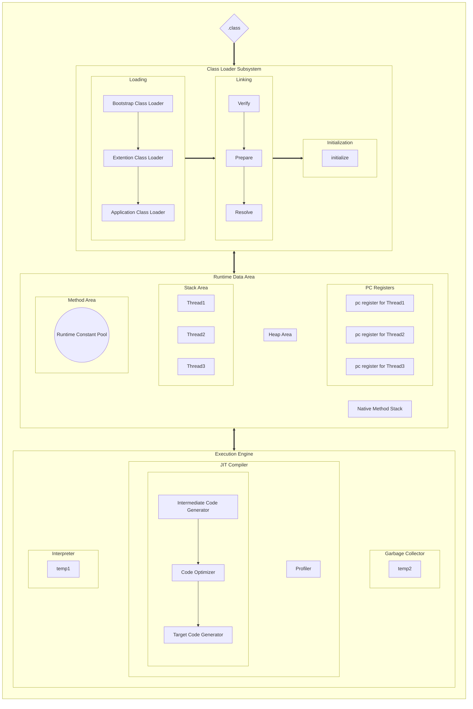

## JVM 이란?

* 자바의 큰 장점인 **WORA(Write Once, Run Anywhere)** 가 가능한 이유는  **JVM(Java Virtual Machine)** 이라는 `플랫폼 소프트웨어` 의 도움 덕분입니다.

* JVM 자체는 OS의 종류에 종속적이지만, 사용자는 `JRE(Java Runtime Environment)` 를 설치하면, JRE에 포함된 JVM을 통해서 자바 애플리케이션을 어디서나 실행할 수 있게 되는 방식입니다.

* 자바 애플리케이션은 아래 순서로 실행됩니다.

좀 더 이해하기 쉽도록, 전반적인 과정에 대해서 간단하게 설명하겠습니다.

1. 자바 소스코드로 작성된 소스파일은 `javac` 라는 컴파일러를 통해서 JVM에서 실행 가능한 형태의 바이트 코드로 변환합니다.
2. 바이트 코드는 `매직넘버`, `상수 풀`, `클래스의 정의`, `필드`, `메소드 및 어트리뷰트` 들에 대한 정의를 포함합니다.
   * 매직넘버
     *  파일의 종류에 대한 identifier (파일의 타입을 이를 통해서 식별)
   * 상수 풀
     * 클래스에서 사용되는 상수 (e.g. `문자열`, `숫자`, `클래스 참조`) 를 저장하는 테이블
     * 고유한 인덱스를 가지며, 클래스의 메소드와 필드에서 참조됨
   * 클래스의 정의
     * 접근 제어자
     * 클래스의 이름
     * 부모 클래스의 정보
     * 클래스가 구현하는 인터페이스
   * 필드
     * 클래스의 변수 정보를 포함
     * 각각의 필드는 `이름`, `타입`, `접근 제어자` 및 `기타 속성`을 가짐
   * 메소드
     * 클래스의 메소드 정보를 포함
     * `메소드의 이름`, `리턴 타입`, `매개변수 타입`, `접근 제어자` 및 `바이트코드`가 저장
   * 어트리뷰트
     * `클래스`, `필드`, `메소드` 에 대한 추가 정보
     * e.g.) `디버깅 정보`, `소스 파일 이름` 

3. 바이트코드를 기반으로 JVM은 이를 **해석하고 검증하며 실행**합니다.

## JVM under the hood

JVM은 역할에 따라서 크게 3개의 서브 시스템으로 분류할 수 있습니다.

1. **Class Loader**
   * `.class` 파일을 loading, linking, initialize 하는 역할을 수행합니다.
2. **Runtime Data Area**
   * 자바 애플리케이션을 실행하기 위한 실제 데이터가 저장되는 공간
3. **Execution Engine**
   * Runtime Data Area에 데이터를 적재한 이 후, 바이트코드를 읽고 실행하는 역할을 수행합니다.

### Class Loader?

`JVM의 Class Loader`는 아래와 같은 서브 시스템으로 구성됩니다.

#### Loading

자바가 동적으로 클래스를 읽어오므로, 런타임에 `바이트코드(.class)` 가 JVM에 로드 되어야합니다.

**Class Loader가 이 과정에서 JVM의 메소드 영역에 동적으로 `.class` 파일을 로드합니다** 

* **Bootstrap Class Loader**
  * $$\equiv \textrm{Primordial Class Loader}$$
  * JVM의 일부로 동작하며, 성능을 위해서 `Native C`로 실행됩니다.
  * 최상위의 class loader
    * 자바 클래스를 로드할 수 있는 자바 자체의 클래스 로더와 최소한의 자바 클래스를 로드합니다.

* **Extention Class Loader**
  * `java.ext.dirs` 환경 변수에 설정된 디렉토리의 클래스 파일을 로드합니다.
  * 환경변수가 세팅되지 않았을 경우, `${JAVA_HOME}/jre/lib/ext` 에 있는 클래스 파일을 로드합니다.
    * 주로 **외부 라이브러리, 서드파티 라이브러리, 드라이버**등이 존재하는 디렉토리입니다.
* **Application Class Loader**
  * `지정한 classpath` 에 존재하는 클래스 파일 또는 `.jar` 에 속한 클래스들을 로드합니다.
    * 즉, 사용자가 만든 자바 코드의 클래스 파일을 로드합니다.

#### Linking

로딩된 바이트코드를 실행하기 이전에 전처리하는 역할을 담당합니다.

* **Verify**
  * bytecode가 적절한지 검증하는 과정을 거칩니다.
  * 검증에 실패할 경우, exception을 던집니다.
* **Prepare**
  * 모든 `static variable` 들에 대해서 메모리를 할당합니다.
  * 이 후, default value를 할당합니다.
* **Resolve**
  * *symbolic memory reference* 가 이 과정에서 `Runtime Data area` 에 할당된 실제 레퍼런스로 치환됩니다.
  * e.g.) 다른 클래스의 메소드나 필드를 참조할 때, 해당 참조를 실제 주소로 변환

#### Initialization

클래스의 static 블록과 static 변수를 초기화하는 단계입니다.

* 클래스가 처음 로딩될 때 `static 초기화 블록` 이 실행됩니다.
  * 이 과정에서 static 변수들이 실제 값으로 초기화 됩니다.

이 과정까지 마치고 나면, 이제 해당 클래스는 **사용가능한 상태**가 됩니다.

### Runtime Data Area?

JVM의 Execution Engine이 자바 애플리케이션을 실행하기 위해서, 애플리케이션에 사용되는 데이터들을 로드하는 공간입니다.

**데이터의 격리성**과 관련된 내용과 **어떠한 특성의 데이터**가 저장되는지를 유의하여 보시면 도움이 될 것 같습니다.

#### Method Area
* 모든 **class level**의 데이터가 여기에 저장됩니다.
* **static variable**도 이 공간에 저장됩니다.
* ***JVM 프로세스 하나에 1개의 Method Area가 존재합니다***

#### Heap Area

* 참조형 인스턴스가 할당되는 공간입니다.
  * 가비지 컬렉션(GC)의 대상입니다.
* 모든 Thread가 공유하는 영역이며, 특정 Thread에서 실제로 참조하고 있는 데이터들이 저장되는 공간입니다.
* ***JVM 프로세스 하나에 1개의 Heap Area가 존재합니다***

#### Stack Area

* 모든 Thread가 각각의 Runtime시에 독립적인 Stack Area를 가집니다.
* Thread에서 새로운 함수를 호출하였을 때 Stack Frame이 쌓이는 공간이기도 합니다.
* **격리성**을 보장할 수 있습니다. (*Thread-safe*)

#### PC Registers

* 각각의 Thread마다 독립적인 PC Register를 가집니다.
* 특정 Thread에서 실행 중인 명령어의 주소를 저장합니다.

### Execution Engine?

JVM의 Execution Engine에서는 Runtime Data Area에 로드된 데이터를 이용하여 실제 바이트코드를 읽고, 실행하는 역할을 수행합니다.

* **Interpreter**
  * 바이트 코드를 하나씩 읽어서 해석한 다음 바로 실행
    * *Interprete Faster but, executes slowly*
  * 동일한 바이트 코드 명령어임에도 불구하고, 매번 interprete 하는 과정이 필요하기 때문에 반복적인 바이트 코드를 모두 interpreter로 처리하는 것은 비효율적입니다.
* **JIT Compiler**
  * interpreter의 단점을 극복하기 위해서 고안된 방법
  * 바이트코드를 읽어 빠른 속도로 기계어를 생성, 코드가 실행되는 과정에서 실시간으로 일어납니다 (Just-In-Time)
    * Profiler에 의해서 반복되는 횟수가 많은 명령어 블록들을 분석
  * 전체 코드의 필요한 부분만 변환
    * 변환된 코드는 캐시에 저장되기 때문에, 재사용시 컴파일을 다시 할 필요가 없습니다.
  * [Under the Hood {최적화 기법들}](https://mangkyu.tistory.com/343)
