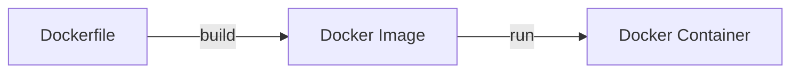

## 개요

처음 도커(Docker)를 접했을 때의 막연함이 떠오릅니다. 

당시에는, 왜 이것을 사용하는지, 필요성은 무엇인지를 알기 위해 여러가지 레퍼런스를 찾아가며 공부했던 기억이 납니다.

제한된 분량으로, 세부적인 기능들에 대해서는 다루지는 않습니다.

Article의 특성 상, `아 이래서 사용하는 구나`, `어? 이런 장점이 있구나 우리 프로젝트에 도입해보면 좋겠는데?` 정도로 이해해주시고

필요할 때, 세부 내용을 찾아 공부하시는 것을 추천드립니다.

## 도커(Docker)란?

> Docker provides the ability to **<u>package</u>** and run an application in a **<u>loosely isolated environment</u>** called a container. The isolation and security <u>lets you run many containers simultaneously on a given host</u>. Containers are **lightweight and contain everything needed to run the application**, so you don't need to rely on what's installed on the host. You can share containers while you work, and be sure that everyone you share with gets the same container that works in the same way.
>
> 출처: [도커 공식 문서](https://docs.docker.com/get-started/docker-overview/)

공식 문서의 설명에 따르면, 도커는 컨테이너 가상화 기술을 기반으로 `고립성`, `일관성` 을 보장하는 실행환경에서 애플리케이션을 동작시키는 플랫폼 어플리케이션입니다.  `build, test, deploy` 과정 전반에서 효율성을 위해서 사용되는 플랫폼이라고 해석할 수 있겠습니다.

컨테이너 가상화 기술에 대해서는 아래 챕터에서 다뤄보도록하고, 과거의 배포 방식과 비교하여 장단점과 특징들을 설명하겠습니다.

---

### 전통적인 배포 방식

* 특징

  * Application이 물리 서버에 직접 배포되는 형식입니다.
  * Application은 단일 OS의 도움을 받아 하드웨어 자원들을 점유합니다 (`CPU`, `Memory` 등등..)

* 단점

  * 애플리케이션의 리소스 한계를 정의할 수 없어, 리소스 할당의 문제가 발생할 수 있습니다.

    * 多 애플리케이션들이 배포될 경우 문제가 될 수 있습니다.

    과거에는 여러 개의 물리 서버를 활용하여 해당 문제를 해결하였습니다.

### 가상화된 배포 방식(VM)

애플리케이션의 리소스 할당을 유연하게 하기 위해서 가상화 기술이 등장하였습니다.

가상화 기술을 통해서 Application이 실행되는 환경을 독립적으로 구성하고, 이를 관리해주는 계층을 도입하여 리소스 할당과 관련된 문제를 해결할 수 있습니다.

* 특징
  * 가상 머신 방식에서는 물리 하드웨어의 자원을 VM에 할당하는 `하이퍼바이저`가 존재합니다.
  * 물리 서버에서 리소스를 보다 더 효율적으로 활용할 수 있습니다.
  * 각각의 Virtual Machine은 **가상화된 하드웨어 상에서 자체 운영체제를 포함한 모든 구성 요소를 실행합니다**.

* 단점
  * VM마다 Guest OS가 할당되기에 무겁습니다.
    * 커널을 포함한 완전한 운영체제를 실행하므로 시스템 리소스(CPU, Memory, Storage)를 크게 요구합니다.
  * VM이 많을수록 전통적인 방식보다 안정성이 떨어지고 실행 속도가 느려집니다.
    * `Hypervisor - OS - middleware - application` 까지 실행되어야합니다.
  * VM에서 운영체제의 업데이트나 마이그레이션을 수행할 경우, 경우에 따라서 완전하게 새로운 VM으로 구성해야합니다. 이 경우에 시간이 매우 오래걸리게 됩니다.

### 컨테이너 가상화를 이용한 배포 방식

컨테이너 기술은 LXC(Linux Container)을 기반으로 여러가지 형태로 구현됩니다.

> Linux Container란?
>
> 호스트OS에서 프로세스 간 격리를 구현하는 기술.
>
> 하나의 프로세스의 자원을 관리하는 기능 + 특정 애플리케이션이 자원을 독점하지 않도록 제한하는 기술들이 결합되어 이를 구현합니다.
{. prompt-info} 

* 특징
  * 각각의 컨테이너에는 Application 구동에 필요한 최소 구성 요소(바이너리, 라이브러리) 파일만 포함됩니다.
    * VM에 비해서 lightweight 합니다.
    * 실행시간, 이미지 크기 등등..
  * Container Engine이 실행되는 Operating System을 모든 컨테이너가 공유합니다.
    * 하나의 OS가 각각의 컨테이너에 리소스를 할당해주는 방식입니다.
    * 커널 구성을 따로 할 필요없이 공유합니다.
* 단점
  * 커널과 관련된 작업을 수행할 수 없습니다. 또한, 컨테이너마다 다른 커널 작업을 수행할 수 없습니다.
  * 격리 수준이 VM보다는 떨어집니다.
    * 그로 인하여 하나의 컨테이너에서 공유되는 하드웨어 자원에 exploit하여 전체 컨테이너에 영향을 미칠 수 있습니다. 

---

이 중 도커의 ecosystem 을 구성하는 `도커 엔진(Docker Engine)` 이 `Container Engine` 에 속합니다.

도커는 컨테이너 가상화 기술을 활용한 플랫폼 소프트웨어인데요.

컨테이너 가상화 기술에 대한 특징들 외에도 **코드 기반으로 인프라를 구축**할 수 있다는 것이 또 다른 장점이라고 생각합니다. (<u>**Infrastructure as Code, IaC**</u>)

이를 이해하기 위해서는 도커의 기능들과 배포 과정의 흐름을 살펴보는 것이 우선시 되어야할 것 같습니다.

## Docker 기초

### Image

* 도커에서의 이미지는 컨테이너를 생성하기 위한 하나의 Template입니다.

* 이미지는 DSL(Domain Specific Language)를 이용하여 구성합니다.
  * 이렇게 DSL로 작성된 파일을 `Dockerfile` 이라고 합니다.

* `Dockerfile` 이 build 된 이후에 (`DockerEngine의 Build 과정`)
  * `Dockerfile`은 이미지화 되어 로컬 Docker 이미지 저장소에 저장됩니다.
* 이렇게 이미징된 이미지들은 기본적으로 아래의 특성을 가집니다.
  * 불변성
    * 이미지에 변경사항이 존재할 경우, 기존 이미지를 기반으로 새로운 이미지를 생성
  * 재사용성
    * Docker Image는 다른 Image의 base로 재사용될 수 있음

### Registry

* `Docker Registry` 는 Docker 이미지를 저장하고 배포하기 위한 **중앙 집중식 저장소**입니다.
  * public, private 하게 구성이 모두 가능합니다.
  * `Docker Hub`는 Public Docker Registry의 구현체 중 하나입니다.

* Docker Registry에는 여러 개의 Image들을 push할 수 있고, `${name} : ${tag}` 으로 이미지를 식별합니다.

## 서비스 측면에서의 도커

개발자로써 배포와 관련하여 도커를 어떻게 활용해야할지 고민해보는 것이 좋겠습니다. 

앞서 살펴보았듯, 도커는 컨테이너 기반의 가상화 기술을 활용하여 애플리케이션을 일관된 환경으로 빠르게 배포하는 것(load 속도가 빠름)에 도움을 줍니다.

현대의 소프트웨어는 주기를 가지며 지속적으로 개선되는 Lifecycle을 가지고 있습니다. 이러한 환경에서 도커는 애플리케이션을 빠르게 배포하고 테스팅하는 것에 적합합니다. (**High-velocity 환경에 적합**)

---

### 수 많은 컨테이너의 사용?

마이크로서비스로 서비스를 구성하게 된다면, 한번에 띄워야하는 컨테이너의 수가 많아 실수의 여지가 있고 컨테이너 간 선후관계를 생각해야할 수도 있습니다.

한번에 여러 개의 도커 컨테이너들을 띄울수 있는 도구가 없을까요?

단순하게 많은 컨테이너들을 정의하여 로드하는 것이 목적이라면 `Docker Compose`를 고려해보시는 것을 추천합니다.

자세한 내용은 [도커 컴포즈 공식문서](https://docs.docker.com/compose/) 를 참고해주세요

---

### 컨테이너 관리의 고도화 필요

현대의 웹 애플리케이션은 특정 기간에 사용자가 몰리는 경향성을 가지고 있습니다. 그럴 때, 사용자의 요구를 최대한 많이 수용할 수 있는 인프라 환경을 갖추어야하는데요.

사용자의 요구가 몰릴 것을 생각하여 미리 서버를 scale-out 하는 방식도 있겠지만, 이는 효율적이지 못한 방식입니다.

이에 따라 컨테이너의 auto scaling이 필요해졌습니다.

이 때 고려해볼만한 컨테이너 오케스트레이션 툴로 `kubernetes(k8s)` 가 있습니다.

쿠버네티스는 다양한 기능을 제공하지만, 특히나 하나의 애플리케이션을 작은 마이크로서비스로 분할하고, 각각에 대해서 다른 수준의 확장이 필요할 경우 쿠버네티스는 좋은 선택지가 될 수 있습니다.

자세한 내용은 [쿠버네티스 공식문서](https://kubernetes.io/docs/concepts/overview/#why-you-need-kubernetes-and-what-can-it-do) 를 참고해주세요

