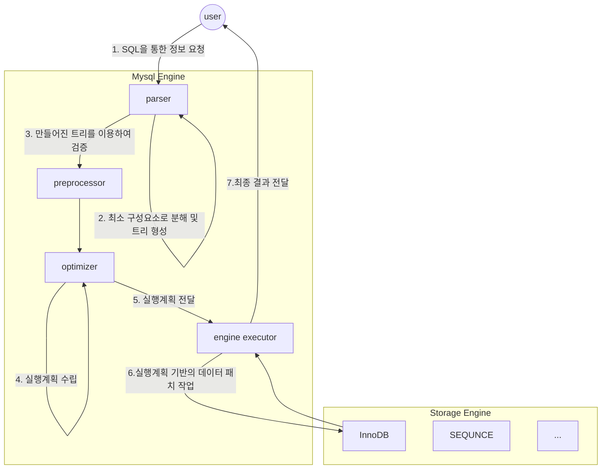

> 쿼리 튜닝에 앞서 기본적으로 알아야하는 용어들을 정리하였습니다.
>
> 튜닝 수행과정에서 DBMS의 전반적인 구조와 메커니즘에 기반을 둔 종합적인 사고를 갖추기 위해서 아래의 내용은 반드시 숙지해야합니다.
{: .prompt-info}

## 물리 엔진과 오브젝트 용어

### 엔진 용어


1. user가 SQL을 입력하고 실행한다면 mysql 엔진에서는 가장 먼저 parser가 user input을 **최소 구성 요소(=토큰)**로 분해하여 트리 형식으로 내부 처리합니다.
   * 이 과정에서 문법 오류를 판단하고, 문법 오류가 존재할 경우 사용자에게 이 사실을 통보합니다.
2. 문법 오류가 존재하지 않아서 트리 형태를 구성할 수 있다면 전처리기에서 SQL구문에 대한 Validation 과정을 수행합니다.
   * parser가 만든 트리를 기반으로 SQL구문의 유효성 검증을 수행
   * 각 토큰에 해당하는 테이블, 컬럼, 프로시저 등이 존재하는지 확인합니다.
   * 객체의 접근 권한을 확인합니다.
3. 검증이 완료될 경우 optimizer에게 **parse tree** 에 대한 실행계획을 수립하도록 위임합니다.
   * 쿼리를 최적으로 실행하기 위한 실행 계획을 수립합니다.
     * 실행 계획이 매우 多 인 경우, 모든 실행계획을 수립하고 비용을 산정하여 최적의 실행계획을 선택 하기까지 시간이 많이 소요되므로 모든 실행계획에 대한 판단을 수행하진 않습니다.
     * 그렇기에, **옵티마이저가 선택한 실행계획이 항상 최적은 아닐수도 있다는 것을 염두에 두어야 합니다.**
4. engine executor
   * **mysql engine, storage engine 전반에 걸치는 오브젝트**
   * optimizer에서 수립한 실행계획을 참고하여 스토리지 엔진에서 데이터를 가져오는 역할을 수행합니다.
     * <u>MySQL엔진에서는 읽어온 데이터를 정렬하거나 조인하고, 불필요한 데이터는 필터링하는 추가작업을 진행합니다.</u>
     * 따라서, **MySQL엔진의 부하를 줄이려면 Storage Engine에서 가져오는 데이터의 양을 줄이는 것이 매우 중요합니다**.


### DB오브젝트 용어

#### 기본키

* 특정 행을 대표하는 열
* 인덱스의 역할을 수행 (기본키를 활용한 인덱싱 가능성)
* mysql에서 기본적으로 clustered index로 지정되며 비슷한 기본 키의 구성 열 순서를 기준으로 물리적인 스토리지에 데이터가 쌓입니다.
  * 비슷한 키들이 근거리에 적재되므로 기본키를 활용하여 인덱스 스캔을 수행하면 더 빠르게 데이터 테이블에 접근할 수 있습니다.

#### 외래키

* 외부 테이블(outer table)을 항상 참조하면서, 외부 테이블의 데이터가 변경되면 함께 영향을 받는 관계를 설정하는 키
  * `외부 테이블 = 부모 테이블`
  * `내부 테이블 = 자식 테이블`
* 내부 테이블에서 외래키로 설정된 열의 값을 수정할 때는 항상 `외래키 제약조건`을 항상 검증하므로 데이터 정합성을 높히는 것에 도움을 줄 수 있습니다.

#### 인덱스

* 데이터베이스에서 키값으로 실제 데이터 위치를 식별하고 데이터 접근 속도를 높이고자 생성되는, **키 기준으로 정렬된 오브젝트**
  * 저장된 데이터를 검색할 일이 많을 경우에는 인덱스를 설계하고 생성하는 과정이 매우 중요하다는 것을 알 수 있습니다.
* 열의 속성에 따른 구분
  1. 고유 인덱스(Unique Index)
     * 인덱스를 구성하는 열들의 데이터가 유일하다는 의미
     * <u>NULL 값을 허용합니다.</u>
     * 차례로 정렬되는 인덱스 열의 데이터는 서로 중복되지 않고 유일성을 유지합니다.
       * 만약, 동일한 데이터가 생성되면 고유 인덱스의 **중복 체크 과정**에서 에러가 발생합니다.
       * 또한, 중복된 데이터가 없는 열들을 고유 인덱스로 생성하려고 한다면 중복이 있는지 검증하는 절차를 추가 수행하므로 **불필요한 중복 검증 과정이 추가**됩니다.
     * ex) `ALTER TABLE 학생 ADD UNIQUE INDEX 연락처_인덱스(연락처)` 
  2. 비고유 인덱스(Non Unique Index)
     * 고유 인덱스에서 데이터의 유일한 속성만 제외한 키
     * 데이터가 신규 입력되어 인덱스가 재정렬되더라도 **인덱스 열의 중복 체크를 거치지 않고 단순한 정렬 작업**을 수행합니다.
     * ex) `ALTER TABLE 학생 ADD INDEX 이름_인덱스(이름)`


#### 뷰

* 일종의 **가상 테이블**
  * 실체는 없지만 간접적인 방식으로 대상을 확인할 수 있는 방법
* 양방향 매핑의 개념
  * 참조하는 테이블의 정보가 변경된다면, 뷰에도 변경사항이 반영됩니다.
  * **업데이트 가능한 뷰** 로 생성할 경우가 이에 해당합니다.
    * 업데이트 가능한 뷰에서도 모든 뷰가 업데이트가 가능하지는 않습니다. (e.g. 집계함수가 포함된 뷰, 그룹화가 포함된 뷰)

* 이점

  * 특정 테이블의 개인정보를 **외부에 직접적으로 공개하지 않고도, 특정 테이블의 뷰를 만들어 제한된 정보만을 제공**할 수 있습니다.
    * 시스템을 안전하게 운영/개발할 수 있는 가치를 제공합니다.
    * "노출에 민감한 데이터에 대해서는 제약을 두고, 일부 데이터를 공개하여 얻을 수 있는 이점이 크다"
  * 여러 개의 테이블을 `join`하여 활용할 때는 성능을 고려한 최적화된 뷰를 생성함으로써 일관된 성능을 제공할 수 있습니다.
    * 특정 정보를 얻기 위해서 매번 join하여 가져오는 것은 테이블의 형태가 변화할 경우 유지보수 측면에서 좋지 않습니다. 하지만, 뷰를 참조하여 특정 정보를 얻어오게 된다면 기존 테이블의 구조가 변경되어도 해당 뷰를 생성하는 부분만 수정하면 되므로, 유연성 측면에서도 이점이 있습니다.

  


ex) 학생 뷰 생성

 ```mysql
CREATE VIEW 학생_뷰 AS
SELECT 학번, 이름 
FROM 학생;
 ```

  

### 논리적 SQL 개념 용어

#### 서브쿼리 위치에 따른 SQL용어

* sub query: 쿼리 안의 보조 쿼리

* 서브쿼리는 `SELECT`, `FROM`, `WHERE` 절에 위치할 수 있고 각각의 위치에 따라서 부르는 명칭이 다릅니다.
  * <u>`SELECT` : 스칼라 서브 쿼리</u>
  * <u>`FROM`: 인라인 뷰</u>
  * <u>`WHERE`: 중첩 서브 쿼리</u>

* **스칼라 서브 쿼리 (`SELECT절`)**

  * 메인 쿼리의 SELECT 절에는 최종 출력하려는 열들이 나열되므로, 출력 데이터 1건과 스칼라 서브쿼리의 결과의 수가 일치해야합니다.

    * 즉, 스칼라 서브쿼리의 결과값은 1행1열의 구조로 출력되어야합니다.
    * 보통 출력되는 데이터의 수가 1행 1열의 구조를 가지는 집계함수를 많이 사용합니다.

```mysql
SELECT 이름, 
    (SELECT COUNT(*) FROM 학생 AS 학생2
        WHERE 학생2.이름 = 학생1.이름) 카운트
FROM 학생 AS 학생1;
```

​    

* **인라인 뷰 (`FROM절`)**

  * **FROM절 내부에서 일시적으로 뷰를 생성하는 방식입니다.**

  * 인라인 뷰의 결과는 <u>내부적으로 메모리 또는 디스크에 임시 테이블을 생성하여 활용</u>합니다.

```mysql
SELECT 학생2.학번, 학생2.이름
	FROM 
		(SELECT * FROM 학생 WHERE 성별 = '남') 학생2; 
```

* **중첩 서브쿼리 (`WHERE절`)**

  * WHERE 절에서 단순한 값을 비교하는 것 이상의 기능을 원할 때, 서브 쿼리를 추가하여 비교 연산하기 위해서 중첩된 서브 쿼리를 사용합니다.

```mysql
SELECT *
	FROM 학생
		WHERE 학번 = (SELECT MAX(학번) FROM 학생);
```


#### 메인쿼리와의 관계성에 따른 SQL용어

> 서브쿼리는 그 자체가 **독립적인 형태**로 존재할 수도 있고 **메인쿼리와 끈끈한 관계를 유지**하며 존재할 수도 있습니다.
{: .prompt-info}


* 비상관 서브쿼리 (non correlated subquery)

  * 메인쿼리와 서브쿼리간의 관계성이 없음을 의미합니다.
  * 서브쿼리가 독자적으로 실행된 뒤, 메인 쿼리에게 그 결과를 던져주는 방식입니다.
    * 즉, `서브 쿼리 실행` $$\rightarrow$$  `메인 쿼리 실행` 순서로 실행됩니다.
  * 단, DB버전 및 옵티마이저에 따라 서브쿼리가 제거되고 하나의 메인쿼리로 통합되는 뷰 병합(View Merging)이 수행될 수 있습니다 (SQL rewrite)

```mysql
SELECT * 
FROM 학생
WHERE 학번 
IN (SELECT 학번 FROM 학생 WHERE 성별 = '남');
```


* 상관 서브쿼리 (correlated subquery)

  * 메인쿼리와 서브쿼리간의 관계성이 있음을 의미합니다.
  * 서브 쿼리가 수행되려면 메인쿼리의 값을 받아야하므로 서브쿼리와 메인쿼리는 서로 끈끈한 관계를 유지합니다.
    * 즉, `메인 쿼리 실행` $$\rightarrow$$ `서브 쿼리 실행`  $$\rightarrow$$ `메인쿼리 실행` 의 일반적인 흐름을 가지게됩니다. (아래 예시에서)
  * 단, DB버전 및 옵티마이저에 따라 서브쿼리가 제거되고 하나의 메인쿼리로 통합되는 뷰 병합(view merging)이 수행될 수 있습니다. (SQL rewrite)

```mysql
SELECT *
	FROM 학생
		WHERE 학번 
			IN (SELECT 학번 FROM 지도교수 WHERE 학생.학번='1')
			
# 학번에서의 조회결과를 서브쿼리에 전달해야 서브쿼리의 where절이 수행될 수 있음
```


#### 반환 결과에 따른 SQL용어

* 단일행 서브쿼리
  * 서브쿼리의 결과가 **1개의 행**으로 반환되는 쿼리
    * 메인쿼리의 조건절에서는 `=`, `<`, `>` 연산자를 통해서 비교할 수 있습니다.
    *  `SELECT`절의 스칼라 서브쿼리와 동일하다고 볼 수 있습니다.
* 다중행 서브쿼리
  * 서브쿼리의 결과가 **2개 이상의 행**으로 반환되는 쿼리
    * 메인쿼리의 조건절에서는 `IN` 구문으로 서브쿼리에서 반환되는 값들을 받습니다.
* 다중열 서브쿼리
  * 서브쿼리의 결과가 **여러 개의 열과 행**으로 반환되는 쿼리
    * 메인쿼리의 조건절에서는 `IN`구문과 함께 서브쿼리에서 반환되는 열들을 동일하게 나열하여 서브쿼리 결과를 받습니다.

